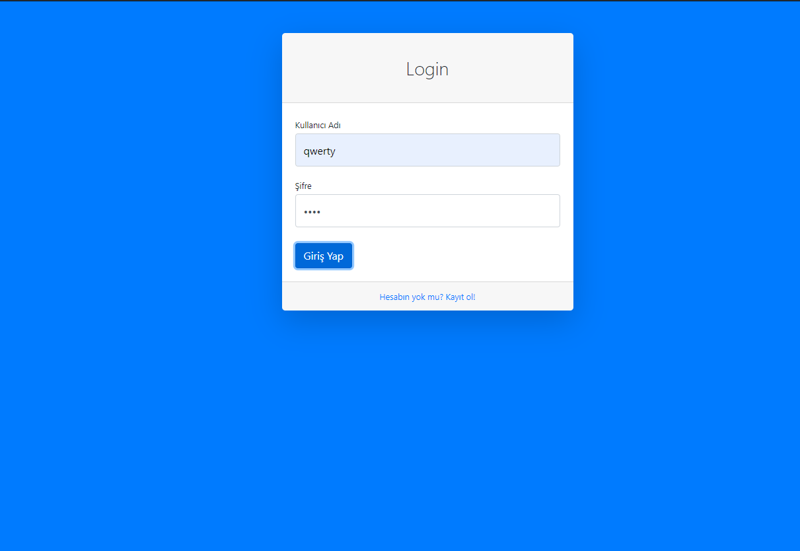
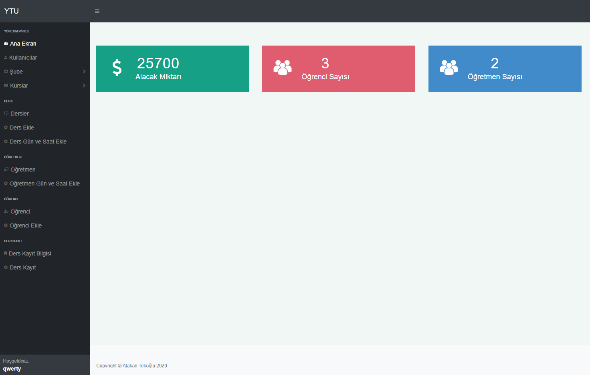
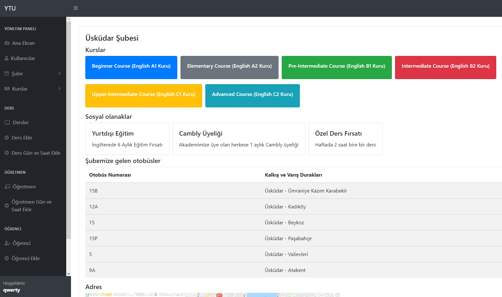
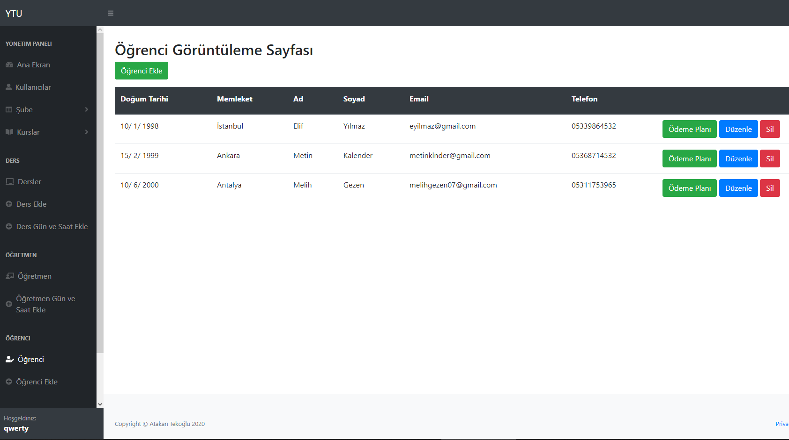
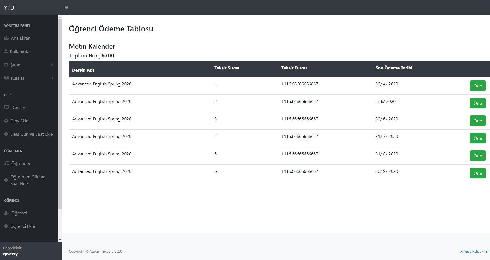
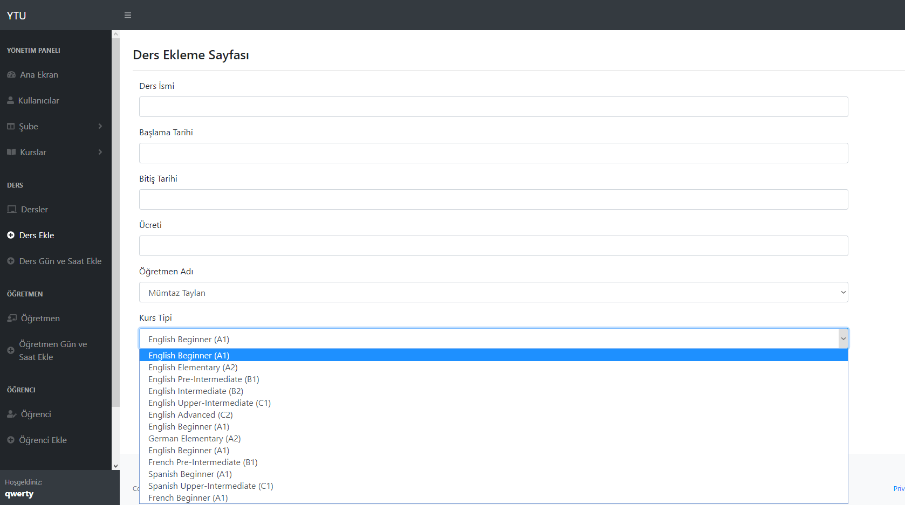

# LanguageSchool
SoftwareEngineering

### 3.sınıf bahar döneminde aldığım yazılım mühendisliği dersi için geliştirmiş olduğum okul yönetim sistemi.

#### Bazı Temel modüller
* Login olma
* Kayıt olma
* Yeni şube açma
* Şubeler için adres, sosyal olanak, ulaşım bilgisi ekleme
* Öğrenci ve öğretmen ekleyip, gerektiğinde silme ya da bilgi düzenleme
* Öğrencinin seçtiği kurs ve kurlara göre fiyat toplamı çıkarma
* Taksitlendirip ödeme işlemei yapma

